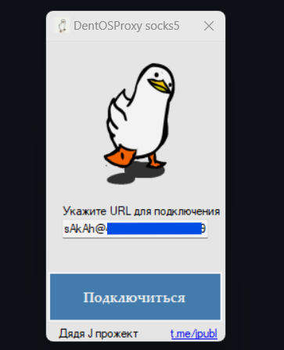

# DentProxy — Simple SOCKS5 Proxy Client

Легкий и быстрый SOCKS5 прокси-клиент на C# (.NET Framework 4.8). 
Создан для тех, кому нужно быстро перенаправить трафик без сложных настроек.

## 🚀 Как это работает
Всё максимально упрощено:
1. Вставляете полную ссылку на ваш **SOCKS5**.
2. Нажимаете кнопку **Подключить**.
3. Работаете.

## 🛠 Техническая часть
* **Язык:** C#
* **Платформа:** .NET Framework 4.8
* **Движок:** Titanium.Web.Proxy + HttpToSocks5Proxy

## 📦 Инструкция по сборке
1. Откройте решение в Visual Studio.
2. Проверьте, что пакеты NuGet восстановились (Restore NuGet Packages).
3. Нажмите `F5` или `Build`.

## 📄 Лицензия
MIT License — используйте как хотите.
